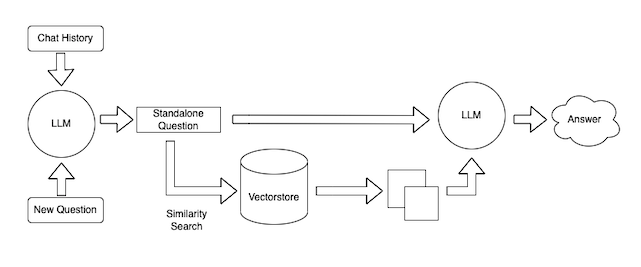

# Langchain Model for Question-Answering (QA) and Document Retrieval using Langchain

This is a Python script that demonstrates how to use different language models for question-answering (QA) and document retrieval tasks using Langchain. The script utilizes various language models, including OpenAI's GPT and Ollama open-source LLM models, to provide answers to user queries based on the provided documents.


<br>

## Setup
Before running the script, you need to set up the required credentials and install the necessary libraries.


## Install Required Libraries
You can install the required libraries using pip. Run the following command in your terminal or command prompt:

```
pip install -r requirements.txt
```

## Set Up API Keys
The script uses the OpenAI API key for different models. You need to set these API keys as environment variables in your system. Replace OPENAI_API_KEY with your actual API keys.


## Usage
1. File Format and Model Type:

    The script supports multiple file support together for loading documents: 'pdf', 'py', 'csv', and 'txt'. You can specify the desired file format and model type using command-line arguments.

- --directory: Specify the directory containing the input files (e.g., 'html', 'pdf', or 'txt' files).
- --model_type: Choose the model type to use for processing (options: 'gpt-4', 'gpt-3.5', 'llama-b7' or 'mistral').

2. Input Documents:

    Place your documents in the specified directory. The script will read the documents based on the provided file format (e.g., 'html', 'pdf', or 'txt'). For using webloader, create urls.txt in the directory including the target links.

3. Run the Script:

    Run the script in your terminal or command prompt with the desired command-line arguments. For example:

4. Enter Queries:

    Once the script is running, it will prompt you to enter your question/query. It will then use the selected model to find relevant answers or retrieve relevant documents.

5. Results:

    The script will display the answer or retrieved documents based on the provided question/query.



<br>

# Streamlit Usage
For initializing Steamlit UI for running Langchain RAG:
```
streamlit run main.py --directory /path/to/documents --model_type "gpt-4" --file_format 'txt' + 'csv'
```

<br>

# Bash Examples
## Example 1: Code Review with OpenAI GPT
```
python langchain_llm.py --directory /path/to/documents --model_type "gpt-4" --file_format 'txt' + 'py'
```

## Example 2: Document Retrieval with Mistral
```
python langchain_llm.py --directory /path/to/documents --model_type "mistral" --file_format 'txt' + 'pdf'
```

## Example 3: Question-Answering with Google's Gemma
```
python langchain_llm.py --directory /path/to/documents --model_type "gemma" --file_format 'txt' + 'pdf' + 'web'
```

<br>

# Important Note
Please ensure that you have valid API keys and access to the required models before running the script. Additionally, make sure the input documents are placed in the specified directory and are in the correct format (html, pdf, or txt).
